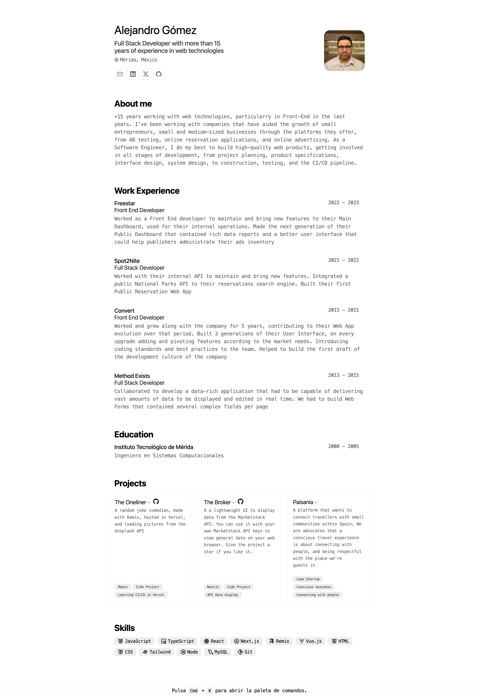

<div align="center">
<h2>
    Minimalist CV designed for web and pdf formats
</h2>
<p>
JSON scheme based on <a href="https://jsonresume.org/schema/">jsonresume.org</a>
</p>
<p>
Design based on <a href="https://github.com/BartoszJarocki/cv">Bartosz Jarocki</a>
</p>
<p>
Astro template based on <a href="https://github.com/midudev/minimalist-portfolio-json">Miguel Angel Durán</a>
</p>

</div>

<div align="center">
    <a href="#🚀-start">
        Get started
    </a>
    <span>&nbsp;✦&nbsp;</span>
    <a href="#🧞-commands">
        Commands
    </a>
    <span>&nbsp;✦&nbsp;</span>
    <a href="#🔑-license">
        License
    </a>
    <span>&nbsp;✦&nbsp;</span>
    <a href="https://gomezarceo.mx">
        Personal
    </a>
   
</div>

<p></p>

<div align="center">


</div>

</img>

## 🛠️ Stack

- [**Astro**](https://astro.build/) - El framework web de la nueva época.
- [**Typescript**](https://www.typescriptlang.org/) - JavaScript con sintaxis de tipado.
- [**Ninja Keys**](https://github.com/ssleptsov/ninja-keys) - Menu desplegable con atajos de teclado hecho en puro Javascript.

## 🚀 Start

### 1. Use this [repo](https://github.com/midudev/minimalist-portfolio-json) as a _template_ for an Astro project

```bash
# Inicializa el proyecto
npm create astro@latest -- --template midudev/minimalist-portfolio-json
```

### 2. Add your content

Edit the file `cv.json` to make your own CV

### 3. Start the development server:

```bash
# Disfruta del resultado
npm dev
```

1. Open [**http://localhost:4321**](http://localhost:4321/) in your browser to see the result 🚀

## 🧞 Commands

|     | Comando         | Acción                                                            |
| :-- | :-------------- | :---------------------------------------------------------------- |
| ⚙️  | `dev` o `start` | Starts a development server in `localhost:4321`.                  |
| ⚙️  | `build`         | Check possible errors and build the production site in `./dist/`. |
| ⚙️  | `preview`       | Opens a preview in `localhost:4321`                               |

## 🔑 License

[MIT](LICENSE.txt) - Template made by [**midudev**](https://midu.dev).
